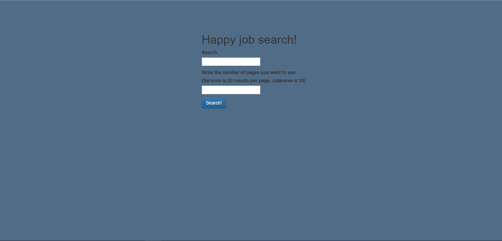
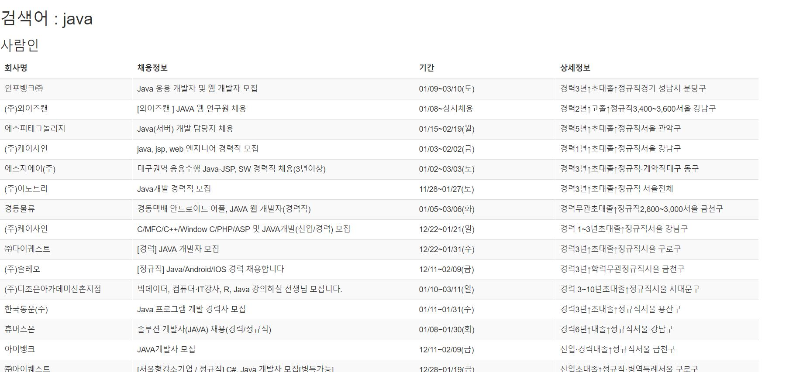
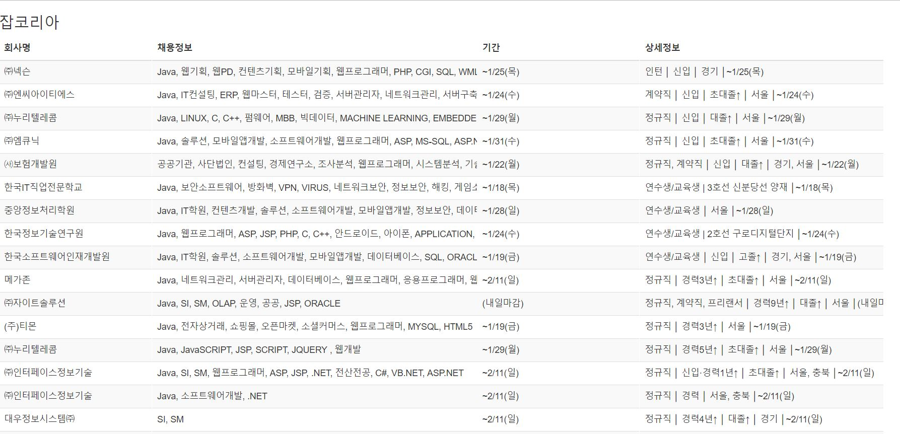

# GG

* This webApp is a job search site based on web scraping by jobkorea and saramin
* This is a scraping project using python library requests, beautifulsoup4

## Stack

* Django Framework

## Quick Start

1. Move to directory: ```cd gg```

2. Run ```pip install -r requirements.txt```

3. Run ```python manage.py runserver``` to see main page at localhost:8000


## What i learned

* CORS issue
* python base
* scraping base


## Look

Main image


Result images




## Improvements

* Resultpage pagination
* Resultpage UI design

